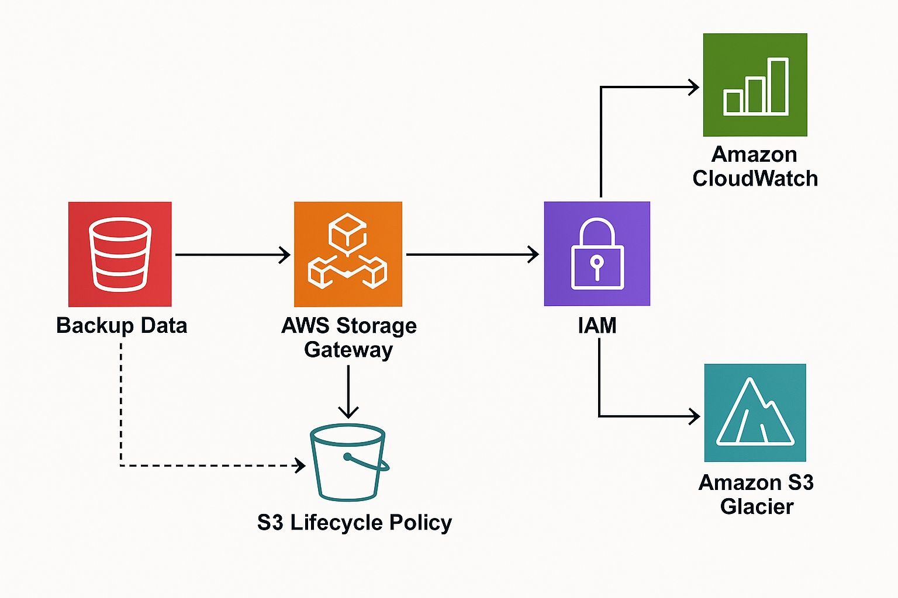

# AWS-Portfolio
AWS Cloud Practioner and Solutions Architect Associate portfolio with hands-on projects
# Project 1: Cloud-Based Backup to AWS

##  Objective
Create a secure, cost-optimized cloud backup architecture using AWS S3 and Glacier, replicating on-prem backup use cases.

##  Use Case
Migrating legacy backup data to AWS with a lifecycle policy that moves cold data to Glacier.

##  AWS Services Used
- S3
- S3 Glacier
- IAM
- AWS Storage Gateway / DataSync
- CloudWatch (optional)

##  Architecture Diagram

##  Steps
1. Create an S3 bucket with versioning enabled
2. Set up IAM roles for access control
3. Configure lifecycle policy to move data to Glacier after 30 days
4. (Optional) Simulate on-prem connection using DataSync/Storage Gateway
5. Monitor with CloudWatch

##  Output
- Secure S3 bucket
- Lifecycle transition to Glacier
- Access logging and monitoring (optional)
- Estimated cost

##  Lessons Learned
_(To be filled after completion)_

## 📸 Screenshots
_(To be added after testing setup)_

